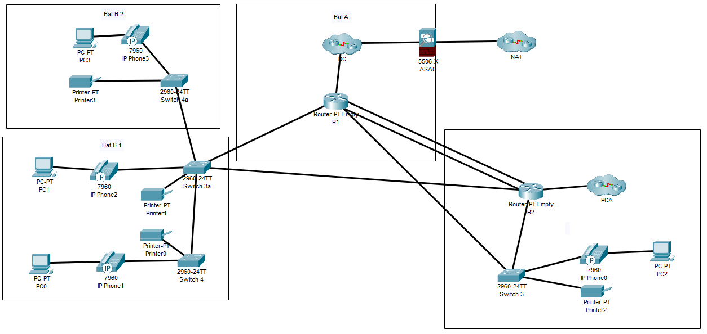

# Archi

Regnault Quentin


TP Continu
Mardi 6 Octobre 2020 


Proposition de l’infrastructure



<br>

### Index des câbles :
* Datacenter vers switch : fibre doublé 
* Switch vers pc téléphones et imprimantes : câble en cuivre

Pour les switchs L1 des aruba 10/100/1000 avec 48 ports sont suffisant
Pour les routeurs nous proposons des ciscos

En cas de crash du premier datacenter une backup total ou partiel dans le bâtiment C est mise en place pour le bâtiment B.
La mise en place d’un Spanning Tree pour éviter une tempête de braodcast

Ajouts de serveurs dans le datacenter pour un extranet avec les 50 postes délocalisé.


## Vlans dans l'infra :
* Vlan 10 id administrateur : Pour les outils des administrateurs 
* Vlan 20 id user : Pour les utilisateurs 
* Vlan 50, 60, 70, 75 id batA, batC, batB, batB1  : Si vous voulez séparer les batiments
* Vlan 30 id datacenter 

## Exemple d'un conf vlan sur un switch :

```
# conf t
(config)# vlan <numéro>
(config-vlan)# name <nom>
[Attribution des ports]
(config)# interface <nom de l'interface>
(config-if)# switchport mode access
(config-if)# switchport access vlan <numéro>
```


Pour les Vlans administrateurs et utilisateurs isl donneront accès aux différents téléphones et imprimantes suivant les besoin et aussi limiter les accès à l'extérieur.

## Agregation et spanning-tree

En ce qui concerne l'agrégation des liens le protocole utilisé est le LACP gérer par l'ordre des switch 

## VRRP


```--------------------------------------------------------------------- ```

